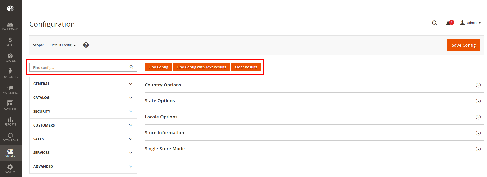
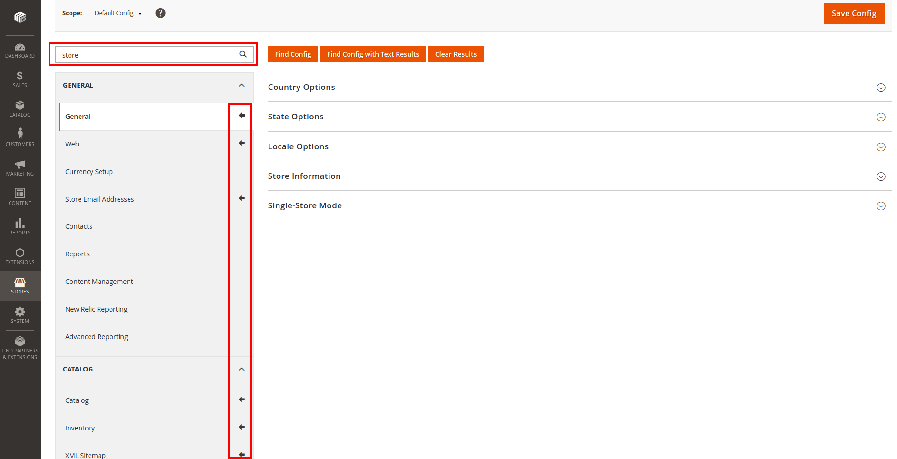
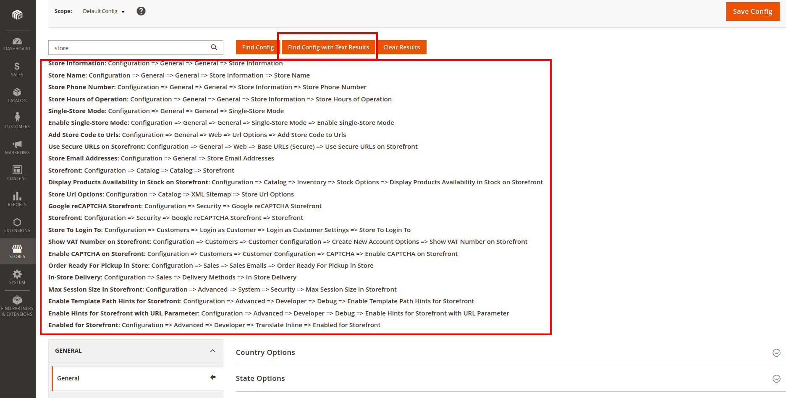
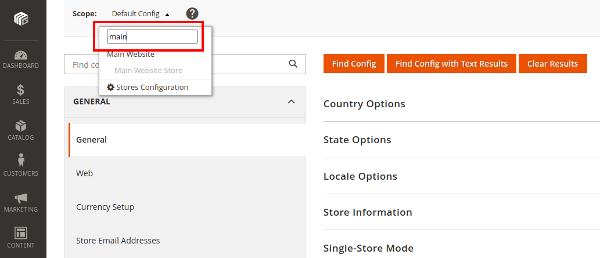

# Magentiz ConfigFinder by Magentiz

Magentiz_ConfigFinder Extension, config finder for magento 2

## Requirements
  * Magento Community Edition 2.4.x or Magento Enterprise Edition 2.4.x
  * Exec function needs to be enabled in PHP settings.

## Installation Method 1 - Installing via composer
  * Open command line
  * Using command "cd" navigate to your magento2 root directory
  * Run command: composer require magentiz/config-finder

## Installation Method 2 - Installing using archive
  * Download [ZIP Archive](https://github.com/magentiz/magento-2-config-finder/releases)
  * Extract files
  * In your Magento 2 root directory create folder app/code/Magentiz/ConfigFinder
  * Copy files and folders from archive to that folder
  * In command line, using "cd", navigate to your Magento 2 root directory
  * Run commands:
```
php bin/magento module:enable Magentiz_ConfigFinder
php bin/magento setup:upgrade
php bin/magento setup:di:compile
php bin/magento setup:static-content:deploy
```

## User guide
Log into the Magento administration panel, go to ```Store > Configuration```.



You can see the Find Config bar with the options:
- Find Config: Search and display the configuration.


- Find Config with Text Results: Search and display the paths (links) to configurations.


- Clear Results: Hide search results.

You can also search for a store to configure.


## Support
If you have any issues, please [contact us](mailto:info@magentiz.com)

## Need More Features?
Please contact us to get a quote
https://magentiz.com/

## License
The code is licensed under [Open Software License ("OSL") v. 3.0](http://opensource.org/licenses/osl-3.0.php).
